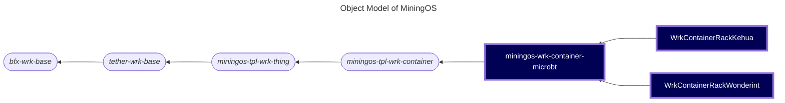

# miningos-wrk-container-microbt

A worker service for managing MicroBT mining containers with support for multiple container types (Kehua, Wonderint) providing monitoring, control, and alerting capabilities.

## Table of Contents

1. [Overview](#overview)
2. [Object Model](#object-model)
3. [Features](#features)
4. [Installation](#installation)
5. [Configuration](#configuration)
6. [Usage](#usage)
7. [API Documentation](#api-documentation)
8. [DHCP Service Integration](#dhcp-service-integration)
9. [Testing](#testing)
10. [Development](#development)
11. [Monitoring and Alerts](#monitoring-and-alerts)
12. [Dependencies](#dependencies)

## Overview

This repository implements a container worker for MicroBT mining equipment, providing:
- Real-time monitoring of power, environmental conditions, and equipment status
- Remote control capabilities for power distribution units (PDUs) and cooling systems
- Comprehensive alerting system for equipment faults and environmental conditions
- Support for multiple container manufacturers (Kehua, Wonderint)

## Object Model

The following is a fragment of [MiningOS Architecture](https://docs.mos.tether.io/) that contains the concrete class representing **MicroBT Container workers** (highlighted in blue). The rounded nodes reprsent abstract classes and the square nodes represents a concrete classes:



Check out [miningos-tpl-wrk-container](https://github.com/tetherto/miningos-tpl-wrk-container) for more information about parent classes.

## Features

- **Power Monitoring**: Real-time tracking of voltage, current, power factor, and energy consumption
- **Environmental Monitoring**: Temperature, humidity, smoke detection, and water ingress monitoring
- **Equipment Control**: Remote socket switching, container power management, and cooling fan control
- **Alert Management**: Configurable alerts with severity levels for various fault conditions
- **Mock Server**: Built-in mock server for testing and development

## Installation

```bash
# Clone the repository
git clone https://github.com/tetherto/miningos-wrk-container-microbt.git
cd miningos-wrk-container-microbt

# Install dependencies
npm install

# Set up configuration files
./setup-config.sh
```

## Configuration

### Basic Configuration

1. Run the setup script to create configuration files from examples:
   ```bash
   ./setup-config.sh
   ```

2. Edit the configuration files in the `config/` directory:
   - `base.thing.json`: Main configuration for timeouts, intervals, and alerts
   - `common.json`: Common settings like logging directory and debug level
   - `facs/*.config.json`: Facility-specific configurations

### Alert Configuration

The system supports comprehensive alert monitoring with configurable severity levels:

- **Critical**: System-critical issues requiring immediate attention
- **High**: Important issues that may affect operations
- **Medium**: Warnings that should be addressed
- **Warning**: Informational alerts

Example alert configuration:
```json
{
  "alerts": {
    "container-mbt-kehua": {
      "water_min_inlet_temp_warn": {
        "description": "Water tank inlet temperature is too low.",
        "severity": "medium",
        "params": {
          "temp": 20
        }
      }
    }
  }
}
```

## Usage

### Running the Worker

```bash
# Wonderint in production mode
node worker.js --wtype wrk-container-rack-wonderint --env=production --rack shelf-0

# Kehua in production mode
node worker.js --wtype wrk-container-rack-kehua --env=production --rack shelf-1

# Wonderint in Development mode with debug output
DEBUG=* node worker.js --wtype wrk-container-rack-wonderint --env=production --rack shelf-0

# Kehua in Development mode with debug output
DEBUG=* node worker.js --wtype wrk-container-rack-kehua --env=production --rack shelf-1
```

### Running the Mock Server

The [mock server](docs/mock.md) is useful for testing without physical hardware:

```bash
# Run mock server for Wonderint container
node mock/server.js --type Wonderint -p 8080 -h 0.0.0.0

# Run mock server for Kehua container
node mock/server.js --type Kehua -p 8080 -h 0.0.0.0

# Run with error simulation
node mock/server.js --type Wonderint --error
```

### API Documentation

The MicroBT container worker manages cooling containers for MicroBT mining equipment through Modbus communication. It inherits RPC functionality from the MiningOS platform through `miningos-tpl-wrk-thing` → `miningos-tpl-wrk-container` → `miningos-wrk-container-microbt`.

#### Architecture

```
┌─────────────┐     RPC      ┌──────────────┐    Modbus     ┌───────────────┐
│  RPC Client ├─────────────►│    Worker    ├──────────────►│   Container   │
│ (hp-rpc-cli)│              │   Service    │               │   Hardware    │
└─────────────┘              └──────────────┘               └───────────────┘
```

#### Service Configuration

- **Service name**: Derived from worker type (see examples)
- **Worker types**: 
  - `wrk-container-mbt-kehua`
  - `wrk-container-mbt-wonderint`
- **Communication**: Modbus TCP (default port: 502)

#### RPC Methods

All standard methods from `miningos-tpl-wrk-thing` are available, with MicroBT-specific implementations:

##### Core Methods

###### `registerThing`
Registers a MicroBT container for monitoring and control.

```bash
hp-rpc-cli -s wrk-mbt -m registerThing -d '{"info":{"container":"microbt-kehua-1"},"opts":{"address":"127.0.0.1","port":5020,"username":"admin","password":"admin"}}'
```

**Parameters:**
- `info.container`: Container identifier
- `opts.address`: Container IP address (localhost for mock)
- `opts.port`: Modbus port (mock default: 5020)
- `opts.username`: Authentication username
- `opts.password`: Authentication password

###### `queryThing`
Executes methods on a specific container.

```bash
hp-rpc-cli -s wrk-mbt -m queryThing -d '{"id":"microbt-kehua-1","method":"getSnap","params":[]}'
```

**Available Container Methods:**
- `getSnap()`: Get complete container state
- `switchSocket(PDUIndex, socketIndex, enabled)`: Control individual sockets
- `switchContainer(enabled)`: Control entire container
- `setCoolingFanThreshold(params)`: Set cooling fan parameters

###### `applyThings`
Execute actions on multiple containers.

```bash
hp-rpc-cli -s wrk-mbt -m applyThings -d '{"method":"setCoolingFanThreshold","params":[{"runningSpeed":2,"startTemp":25,"stopTemp":25}],"query":{"tags":{"$in":["microbt"]}}}'
```

##### MicroBT-Specific Actions

###### `setCoolingFanThreshold`
Controls cooling fan operation parameters (whitelisted with permission level 1).

**Parameters:**
- `runningSpeed`: Fan speed setting
- `startTemp`: Temperature to start fans
- `stopTemp`: Temperature to stop fans

**Example:**
```bash
hp-rpc-cli -s wrk-mbt -m applyThings -d '{"method":"setCoolingFanThreshold","params":[{"runningSpeed":2,"startTemp":25,"stopTemp":25}]}'
```

##### Container State Structure

The `getSnap()` method returns comprehensive container state:

```javascript
{
  success: true,
  model: "container-model",
  power_meters: {
    status: 1,
    voltage_ab: 380.5,
    voltage_bc: 381.2,
    voltage_ca: 379.8,
    total_power_factor: 0.98,
    freq: 50.0,
    current_a: 125.3,
    current_b: 124.8,
    current_c: 126.1,
    total_active_power: 165000,
    total_apparent_power: 168000,
    total_active_energy: 1234567
  },
  pdus: {
    status: 1,
    buzzer: 0,
    sockets: [true, true, false, true, ...],
    // Additional PDU metrics
  },
  env: {
    status: 1,
    smoke_detector: 0,
    water_ingress_detector: 0,
    temperature: 25.5,
    humidity: 45.2
  }
}
```

## DHCP service integration

The `miningos-net.config.json` file contains network-related configuration for the MicroBT container worker, specifically for DHCP service integration.

### Configuration Structure

```json
{
  "n0": {
    "dhcpRpcPublicKey": "DHCP_RPC_PUBLIC_KEY"
  }
}
```

### Configuration Parameters

#### `n0` Object

The `n0` object contains network-related configurations for the primary network interface.

##### `dhcpRpcPublicKey`

- **Type**: `string`
- **Required**: Yes (when using automatic IP assignment)
- **Default**: None
- **Example**: `"your-dhcp-service-rpc-public-key-here"`

**Description**: 
The RPC (Remote Procedure Call) public key for the DHCP service. This key is used to authenticate and communicate with the DHCP service for automatic IP address assignment when an IP address is not manually configured for the container.

**Purpose**:
- Enables secure communication with the DHCP service
- Allows automatic IP address assignment for containers
- Provides fallback networking when static IPs are not configured

**Usage**:
When a container starts without a manually configured IP address, the worker will use this RPC key to request an IP address from the DHCP service automatically.

### Example Configuration

#### With DHCP Auto-Assignment

```json
{
  "n0": {
    "dhcpRpcPublicKey": "MIIBIjANBgkqhkiG9w0BAQEFAAOCAQ8AMIIBCgKCAQEA..."
  }
}
```

#### Setup Instructions

1. Obtain the DHCP service RPC public key from your network administrator
2. Copy `config/facs/miningos-net.config.json.example` to `config/facs/miningos-net.config.json`
3. Replace `"DHCP_RPC_PUBLIC_KEY"` with your actual DHCP service public key
4. Save the file

### Notes

- If you're using static IP assignment for all containers, this configuration may be optional
- Ensure the DHCP service is running and accessible before relying on automatic IP assignment
- The RPC key should be kept secure and not committed to version control

## Testing

```bash
# Run all tests
npm test

# Run linting only
npm run lint

# Run tests only
npm run test:code

# Development mode with mock server
npm run dev
```

## Development

### Project Structure

```
├── config/              # Configuration files and examples
├── docs/                # Additional documentation
├── mock/                # Mock server implementation
├── tests/               # Test suites
├── workers/             # Worker implementations
│   ├── lib/            # Core libraries
│   │   ├── alerts.js   # Alert handling
│   │   ├── container.js # Container control logic
│   │   ├── stats.js    # Statistics collection
│   │   └── utils/      # Utility functions
│   └── *.wrk.js        # Worker implementations
└── worker.js           # Main worker entry point
```

### Adding New Container Types

1. Create a new worker file in `workers/` directory
2. Extend the `WrkContainerRack` base class
3. Add container-specific alert configurations
4. Update mock server to support the new type

## Monitoring and Alerts

The system monitors various conditions and generates alerts:

### System Alerts
- Circulation pump faults and pressure issues
- Temperature sensor failures
- Filter pressure differentials
- Bypass valve malfunctions

### Environmental Alerts
- Water ingress detection
- Smoke detection
- Temperature/humidity sensor faults
- Outdoor ambient conditions

### Power System Alerts
- Power supply issues
- PDU malfunctions
- Voltage/current anomalies

## Dependencies

### Runtime Dependencies
- `async`: Flow control utilities for asynchronous JavaScript
- `debug`: Debug logging utility
- `bfx-svc-boot-js`: Service bootstrap framework
- `miningos-tpl-wrk-container`: Container worker template
- `@bitfinex/lib-js-util-promise`: Promise utility library
- `svc-facs-modbus`: Modbus facility service for communication

### Development Dependencies
- `modbus-stream`: Modbus communication protocol (for testing)
- `brittle`: Test runner
- `standard`: JavaScript linting
- `miningos-mock-control-service`: Mock control service for testing
